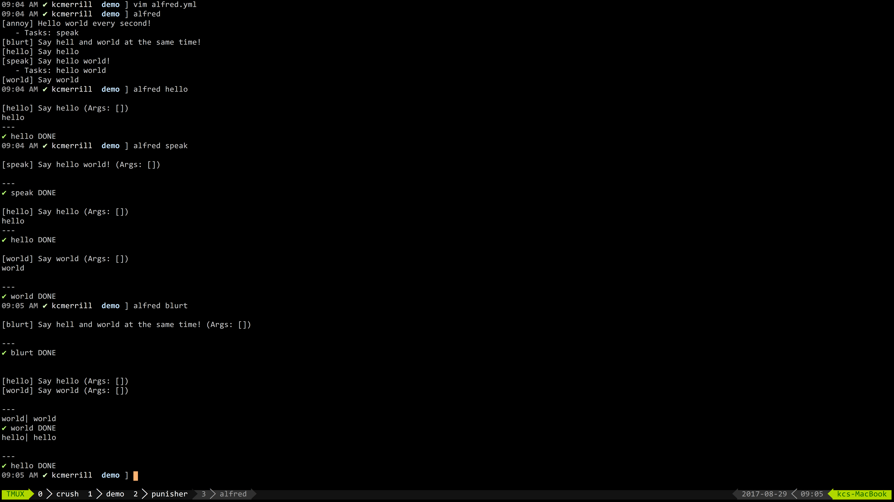

[](https://travis-ci.org/kcmerrill/alfred) [](https://gitter.im/kcmerrill/alfred?utm_source=badge&utm_medium=badge&utm_campaign=pr-badge&utm_content=badge)


> Even Batman needs a little help.

# alfred

A simple go/yaml powered make file/task runner with a bit of a twist and a ton of flexibility + baked in goodies.


## Features

- Extendable. Common tasks(Private too)
- Watch files for modifications
- Retry/Rerun tasks based on failures before giving up
- Logging
- Success/Failure decision tree
- Run tasks asynchronously or synchronously
- Autocomplete task names
- Static webserver
- Many more!

## Usage

Create a file named: `alfred.yml`

```yaml
say.hello:
    summary: I will say hello!
    usage: alfred say.hello
    command: echo "Hello!"

say.howareyou:
    summary: I will ask how you are
    usage: alfred say.howareyou
    command: |
        echo "How"
        echo "Are"
        echo "You?"

speak:
    tasks: say.hello say.howareyou

blurt:
    multitask: say.hello say.howareyou
```

Then, anywhere in the top-level or child directories to the `alfred.yml` file:

`alfred` Will show you all of the available tasks and a quick summary.

`alfred say.hello` Will simply say hello

`alfred say.howareyou` Will ask how you are

`alfred speak` will perform both tasks in the specified order

`alfred blurt` will perform both tasks at the same time

## Quick Walkthrough

To see a comprehensive list of features and functionality please [RTFM](TFM.md "additional documentation").

## Screencast/Demo

[](https://asciinema.org/a/103711)

## Example uses

- Monitor websites
- Setup/Update/Deploy projects in your dev env
- Simple Nagios, Jenkins, pingdom replacement
- Monitor crons(alert on failures, update endpoints etc ... )
- Watch for file modifications to run tests->builds

## Binaries || Installation

[](http://go-dist.kcmerrill.com/kcmerrill/alfred/mac/amd64) [](http://go-dist.kcmerrill.com/kcmerrill/alfred/linux/amd64)

via go:

`$ go get -u github.com/kcmerrill/alfred`

via docker:

`$ docker run -v $PWD:$PWD -w $PWD kcmerrill/alfred`

[](http://forthebadge.com)[](http://forthebadge.com)